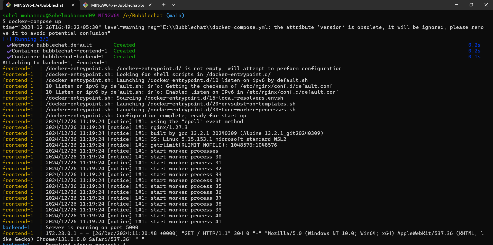
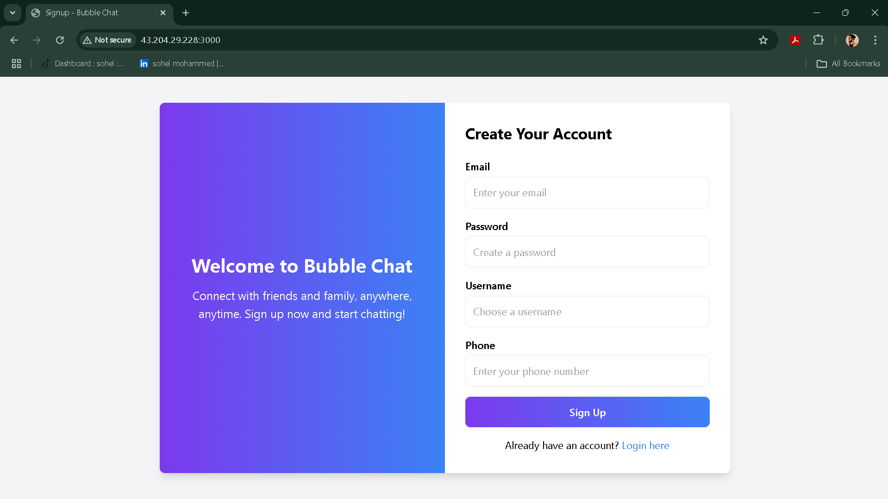
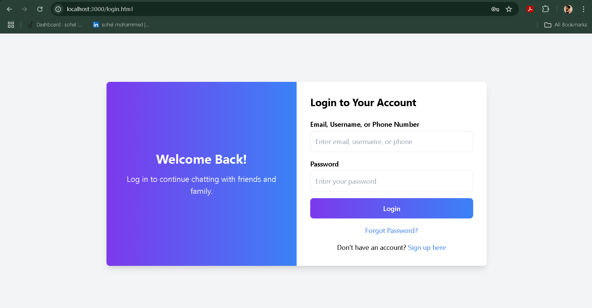
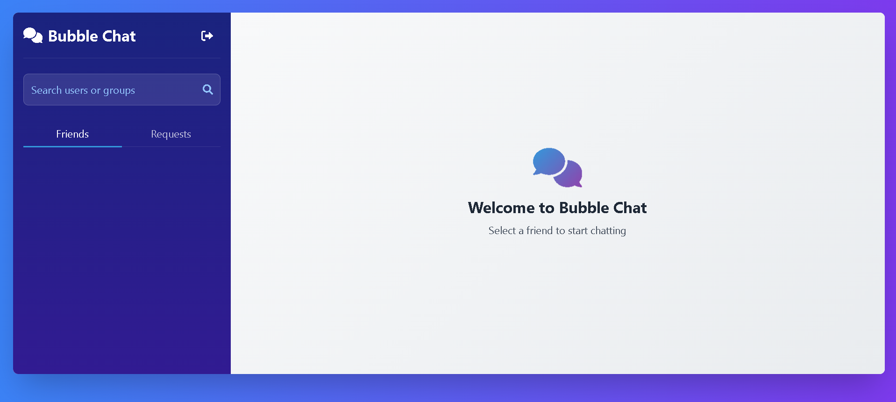

# Real-Time Chat Application - Containerized

**NAME : MOHAMMED SOHEL PASHA** <br>
**COMPANY : CODTECH IT SLOUTIONS** <br>
**ID : CT08EHX** <br>
**DOMAIN : DEVOPS** <br>
**DURATION : DEC - JAN 2025**

## Overview
This project is a real-time chat application built using **Node.js**, **JavaScript**, **CSS**, and **HTML**. The application allows users to communicate in real time, supporting multiple participants in dynamic chat rooms. The app has been containerized using Docker to ensure consistent performance and ease of deployment across various environments.

---

## Features
- **Real-Time Messaging:** Instant communication between users using WebSocket technology.
- **Dynamic Chat Rooms:** Users can join or create chat rooms for topic-specific conversations.
- **Responsive Design:** Fully responsive UI for seamless use across devices.
- **Customizable Interface:** Styled with CSS for an engaging user experience.
- **Dockerized Application:** Containerized to ensure portability and scalability.
- **Easy Setup:** Simple commands to build and run the application.
- **Secure Communication:** Basic security features like user validation to protect chat environments.

---

## Building the Docker Images (Two Dockerfiles Approach)
The application is built using two separate Dockerfiles to handle the frontend and backend services, orchestrated with Docker Compose.

### Steps to Build and Run the Docker Containers:
1. Navigate to the project directory.
2. Use Docker Compose to build and run both services:
   ```bash
   docker-compose up --build
   ```
3. Ensure that both containers (frontend and backend) start successfully.
4. Access the application at `http://localhost:3000`.



---

## Login and Signup Pages
The login and signup pages allow users to securely access and register for the chat application.

### Signup Page

*User registration/signup interface.*

### Login Page

*User login interface.*

---

## Chat Interface
The chat interface is the main feature of the application, allowing real-time communication between users in a clean and responsive layout.



---

## Advantages of a Containerized Application

1. **Portability:**
   - The application can run consistently across different environments, eliminating the "it works on my machine" problem.

2. **Scalability:**
   - Containers allow easy scaling of the application to handle increasing numbers of users.

3. **Simplified Deployment:**
   - Docker Compose simplifies multi-container orchestration and deployment.

4. **Resource Efficiency:**
   - Containers use system resources efficiently, leading to reduced overhead compared to virtual machines.

5. **Isolation:**
   - Each container runs independently, ensuring that the application is isolated from other running processes.

6. **Version Control:**
   - Docker images enable tracking of application versions, allowing rollbacks if necessary.

---

## Getting Started
### Prerequisites
- Install [Docker](https://www.docker.com/)
- Install [Docker Compose](https://docs.docker.com/compose/)
- Basic understanding of Docker commands

### Installation
1. Clone the repository:
   ```bash
   git clone https://github.com/sohelmohammed0/Bubblechat.git
   cd chat-app
   ```

2. Build and run the Docker containers using Compose:
   ```bash
   docker-compose up --build
   ```

3. Open your browser and navigate to `http://localhost:3000` to start using the chat application.

---

## Usage
- Open the app in a web browser.
- Enter a username to join a chat room.
- Start communicating in real-time with other users.
- Create new chat rooms or join existing ones.

---

## Technologies Used
- **Node.js:** Backend framework
- **WebSocket:** Real-time communication
- **JavaScript, CSS, HTML:** Frontend technologies
- **Docker:** Containerization platform
- **Docker Compose:** Multi-container orchestration

---

## Contributing
Contributions are welcome! To contribute:
1. Fork the repository.
2. Create a feature branch: `git checkout -b feature-name`
3. Commit your changes: `git commit -m 'Add feature-name'`
4. Push to the branch: `git push origin feature-name`
5. Submit a pull request.


---

## Contact
For any queries or support, please contact [sohel879879@gmail.com].

